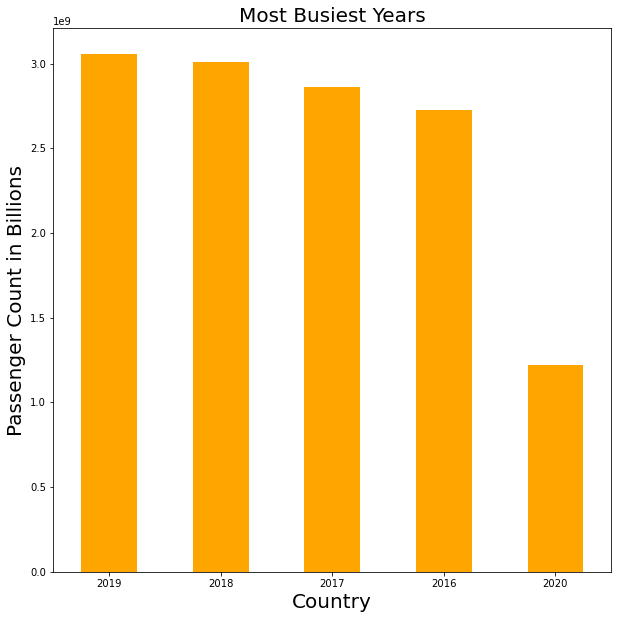

# Busiest Aiports Analysis

# Analysis 

After exploring the dataset, it is evident that the busiest airports are American, China, Japan, and India. In addition, the busiest airports by passengers are Hartsfield-Jackson Atlanta International Airport and Being Beijing Capital International Airport. Furthermore, the busiest year from the dataset is 2019. 2020 was the lowest amount of passengers which can most likely be attributed to covid. 

# Data 

https://www.kaggle.com/khaiid/most-crowded-airports

